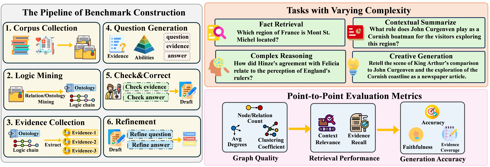

<div align="center">

# When to use Graphs in RAG: A Comprehensive Benchmark and Analysis for Graph Retrieval-Augmented Generation

[](https://arxiv.org/abs/2506.05690)  [](https://huggingface.co/datasets/GraphRAG-Bench/GraphRAG-Bench)  [](https://graphrag-bench.github.io/)  [](https://github.com/GraphRAG-Bench/GraphRAG-Benchmark/blob/main/LICENSE)

<p>
    <a href="#news" style="text-decoration: none; font-weight: bold;">🎉News</a> •
    <a href="#about" style="text-decoration: none; font-weight: bold;">📖About</a> •
    <a href="#leaderboards" style="text-decoration: none; font-weight: bold;">🏆Leaderboards</a> •
    <a href="#task-examples" style="text-decoration: none; font-weight: bold;">🧩Task Examples</a>

</p>
  <p>
  <a href="#getting-started" style="text-decoration: none; font-weight: bold;">🔧Getting Started</a> •
    <a href="#contribution--contact" style="text-decoration: none; font-weight: bold;">📬Contact</a> •
    <a href="#citation" style="text-decoration: none; font-weight: bold;">📝Citation</a> •
    <a href="#stars" style="text-decoration: none; font-weight: bold;">✨Stars History</a>
  </p>
</div>


<h2 id="news">🎉 News</h2>

- **[2026-05-17]** Our **[MemGraphRAG](https://github.com/XMUDeepLIT/MemGraphRAG)** for memory-enhanced RAG is accepted by KDD'26.
- **[2026-04-07]** Our **[ProbeRAG](https://github.com/LinfengGao/ProbeRAG.git)** for RAG faithfulness is accepted by ACL'26.
- **[2026-04-07]** Our **[BAPO](https://github.com/Liushiyu-0709/BAPO-Reliable-Search.git)** for reliable agentic search is accepted by ACL'26.
- **[2026-04-07]** Our **[LegalGraphRAG](https://github.com/XMUDeepLIT/LegalGraphRAG.git)** for reliable legal reasoning is accepted by ACL'26.
- **[2026-04-07]** Our **[LogicPoison](https://github.com/Jord8061/logicPoison.git)**, a GraphRAG attack model, is accepted by ACL'26.
- **[2026-01-26]** Our **[LinearRAG](https://github.com/DEEP-PolyU/LinearRAG)** for efficient GraphRAG is accepted by ICLR’26.
- **[2026-01-26]** Our **[GraphRAG Benchmark](https://github.com/GraphRAG-Bench/GraphRAG-Benchmark)** is accepted by ICLR’26.
- **[2025-10-27]** We release [LinearRAG](https://github.com/DEEP-PolyU/LinearRAG), a relation-free method for efficient GraphRAG.
- **[2025-08-24]** We support [DIGIMON](https://github.com/JayLZhou/GraphRAG) for flexible benchmarking across GraphRAG models.
- **[2025-05-25]** We release the [GraphRAG Benchmark](https://graphrag-bench.github.io) for evaluating GraphRAG models.
- **[2025-01-21]** We release the [GraphRAG survey](https://github.com/DEEP-PolyU/Awesome-GraphRAG).


📃 **Please [cite our paper](#-citation)** if you find our survey or repository helpful!

📫 **Contact us via emails:** `{xiangzhishang,wuchuanjie}@stu.xmu.edu.cn`, `qinggangzhang@jlu.edu.cn`


<h2 id="about">📖 About</h2>


This repository is for the GraphRAG-Bench project, a comprehensive benchmark for evaluating Graph Retrieval-Augmented Generation models.


- Introduces Graph Retrieval-Augmented Generation (GraphRAG) concept
- Compares traditional RAG vs GraphRAG approach
- Explains research objective: Identify scenarios where GraphRAG outperforms traditional RAG
- Visual comparison diagram of RAG vs GraphRAG

<details>
<summary>
  More Details
</summary>
Graph retrieval-augmented generation (GraphRAG) has emerged as a powerful paradigm for enhancing large language models (LLMs) with external knowledge. It leverages graphs to model the hierarchical structure between specific concepts, enabling more coherent and effective knowledge retrieval for accurate reasoning. Despite its conceptual promise, recent studies report that GraphRAG frequently underperforms vanilla RAG on many real-world tasks. This raises a critical question: Is GraphRAG really effective, and in which scenarios do graph structures provide measurable benefits for RAG systems? To address this, we propose GraphRAG-Bench, a comprehensive benchmark designed to evaluate GraphRAG models on both hierarchical knowledge retrieval and deep contextual reasoning. GraphRAG-Bench features a comprehensive dataset with tasks of increasing difficulty, covering fact retrieval, complex reasoning, contextual summarization, and creative generation, and a systematic evaluation across the entire pipeline, from graph construction and knowledge retrieval to final generation. Leveraging this novel benchmark, we systematically investigate the conditions when GraphRAG surpasses traditional RAG and the underlying reasons for its success, offering guidelines for its practical application.

</details>


<h2 id="leaderboards">🏆 Leaderboards</h2>

Two domain-specific leaderboards with comprehensive metrics:

**1. GraphRAG-Bench (Novel)**

- Evaluates models on literary/fictional content

**2. GraphRAG-Bench (Medical)**

- Evaluates models on medical/healthcare content

**Evaluation Dimensions:**

- Fact Retrieval (Accuracy, ROUGE-L)
- Complex Reasoning (Accuracy, ROUGE-L)
- Contextual Summarization (Accuracy, Coverage)
- Creative Generation (Accuracy, Factual Score, Coverage)

<h2 id="task-examples">🧩 Task Examples</h2>
Four difficulty levels with representative examples:

**Level 1: Fact Retrieval**
*Example: "Which region of France is Mont St. Michel located?"*

**Level 2: Complex Reasoning**
*Example: "How did Hinze's agreement with Felicia relate to the perception of England's rulers?"*

**Level 3: Contextual Summarization**
*Example: "What role does John Curgenven play as a Cornish boatman for visitors exploring this region?"*

**Level 4: Creative Generation**
*Example: "Retell King Arthur's comparison to John Curgenven as a newspaper article."*

<h2 id="getting-started">🔧 Getting Started</h2>

First, install the necessary dependencies for GraphRAG-Bench.

```bash
pip install -r requirements.txt
```

## 🛠 Installation Guide

**To prevent dependency conflicts, we strongly recommend using separate Conda environments for each framework:**

We use the installation of LightRAG as an example. For other frameworks, please refer to their respective installation instructions.

```bash
# Create and activate environment (example for LightRAG)
conda create -n lightrag python=3.10 -y
conda activate lightrag

# Install LightRAG
git clone https://github.com/HKUDS/LightRAG.git
cd LightRAG
pip install -e .

```

## 🚀 Running Examples

We provide detailed instructions on how to use GraphRAG-Bench to evaluate each framework. 

Specifically, we introduce how to perform index construction and batch inference for each framework in the `Examples` folder with instructions in the [Examples README](Examples/README.md).

Note that the evaluation code is standardized across all frameworks to ensure fair comparison. Please refer to the `Evaluation` folder and the  [Evaluation README](Evaluation/README.md) for detailed instructions on the evaluation.


<!-- <h2 id="contribution--contact">📬 Contribution & Contact</h2>

Contributions to improve the benchmark website are welcome. Please contact the project team via <a href="mailto:GraphRAG@hotmail.com">GraphRAG@hotmail.com </a>. -->


# 🍀 Citation 
If you find this survey helpful, please cite our paper:

```
@article{xiang2025use,
  title={When to use Graphs in RAG: A Comprehensive Analysis for Graph Retrieval-Augmented Generation},
  author={Xiang, Zhishang and Wu, Chuanjie and Zhang, Qinggang and Chen, Shengyuan and Hong, Zijin and Huang, Xiao and Su, Jinsong},
  journal={arXiv preprint arXiv:2506.05690},
  year={2025}
}
```
